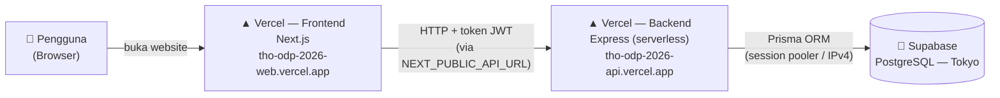
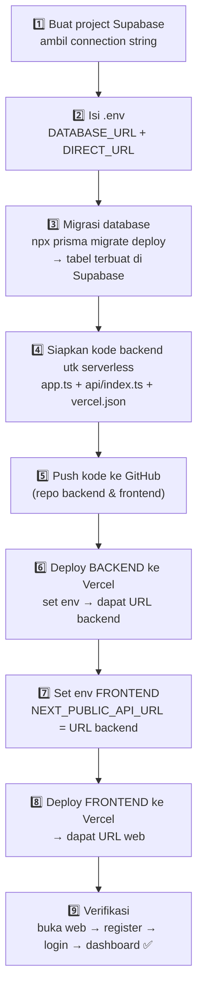
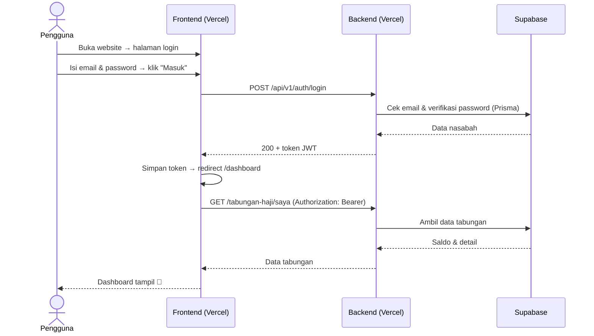

# 📘 Dokumentasi Deployment — Sistem Tabungan Haji

Panduan lengkap alur dari **Supabase** sampai **ter-deploy di Vercel**, ditulis sesederhana mungkin.

| | |
|---|---|
| **Frontend (web)** | https://tho-odp-2026-web.vercel.app · repo: `saint-izrail/THO_ODP_2026_web` |
| **Backend (API)** | https://tho-odp-2026-api.vercel.app · repo: `saint-izrail/THO_ODP_2026` |
| **Database** | Supabase PostgreSQL (region Tokyo) |
| **Terakhir diperbarui** | 2026-05-29 |

---

## 1. Gambaran Umum (analogi sederhana)

Bayangkan aplikasi ini seperti **restoran**:

- **Supabase (Database)** = 🧊 **gudang bahan** — tempat semua data disimpan (nasabah, tabungan, transaksi).
- **Backend / API (Express)** = 👨‍🍳 **dapur** — menerima pesanan, mengambil bahan dari gudang, mengolah, lalu menyajikan.
- **Frontend (Next.js)** = 🍽️ **ruang makan & menu** — yang dilihat & disentuh pelanggan.
- **Vercel** = 🏢 **gedung** tempat dapur dan ruang makan "disewa" agar bisa diakses online 24 jam.

Pelanggan (pengguna) cukup datang ke ruang makan (web). Mereka tidak pernah masuk ke dapur atau gudang langsung.

---

## 2. Arsitektur Production



**Intinya:** Browser → Frontend Vercel → Backend Vercel → Database Supabase. Tiga lapisan terpisah, masing-masing punya alamat sendiri.

---

## 3. Alur Deployment (urutan yang dilakukan, sekali setup)



---

## 4. Penjelasan Tiap Tahap

### 1️⃣–2️⃣ Supabase & Konfigurasi `.env`
Supabase menyediakan database PostgreSQL gratis di cloud. Dari menu **Connect**, kita ambil *connection string*. Ada 2 jenis koneksi yang dipakai aplikasi:

| Variabel | Untuk apa | Kenapa |
|---|---|---|
| `DATABASE_URL` | Koneksi **runtime** (saat aplikasi melayani request) | Pakai **pooler** (`pgbouncer`) supaya hemat koneksi — cocok untuk serverless yang sering hidup-mati. |
| `DIRECT_URL` | Koneksi **migrasi** (membuat/ubah tabel) | Migrasi butuh fitur khusus (advisory lock) yang tidak didukung pooler transaksi. |

> ⚠️ **Pelajaran penting:** koneksi *Direct* bawaan Supabase (`db.xxx.supabase.co`) hanya **IPv6**. Kalau jaringan Anda IPv4, koneksi itu **tidak terjangkau** (error `P1001`). Solusinya: pakai **Session Pooler** (`...pooler.supabase.com:5432`, IPv4) untuk `DIRECT_URL`.

### 3️⃣ Migrasi Database
```bash
npx prisma migrate deploy
```
Perintah ini membaca file di `prisma/migrations/` dan membuat tabel di Supabase (`nasabah`, `tabungan_haji`, `transaksi`, `idempotency_keys`, `token_blocklist`).

> ℹ️ Dashboard Supabase menulis "**No migrations**" — itu **normal**. Widget itu melacak migrasi via *Supabase CLI*, sedangkan kita pakai **Prisma** (punya tabel pelacak sendiri: `_prisma_migrations`). Cek **Table Editor** untuk melihat tabel yang sudah jadi.

### 4️⃣ Menyiapkan Backend untuk Serverless Vercel
Express biasanya jalan sebagai server yang "menyala terus". Vercel pakai model **serverless** (fungsi yang hidup saat ada request). Maka strukturnya dipecah:

| File | Peran |
|---|---|
| `src/app.ts` | Membuat & meng-`export` aplikasi Express (TANPA `listen`) |
| `src/index.ts` | Untuk **lokal**: `import app` lalu `app.listen()` |
| `api/index.ts` | Untuk **Vercel**: `export default app` (jadi serverless function) |
| `vercel.json` | Mengarahkan semua URL ke `api/index.ts` |
| `package.json` → `postinstall: prisma generate` | Agar Prisma Client + engine ter-generate otomatis saat build di Vercel |

### 5️⃣ Push ke GitHub
```bash
git add .
git commit -m "..."
git push
```
> 🔒 File `.env` **tidak ikut** ter-push (sudah di `.gitignore`). Rahasia (password DB, JWT secret) disimpan di **Vercel Environment Variables**, bukan di kode.

### 6️⃣–8️⃣ Deploy ke Vercel (pakai Vercel CLI)
```bash
npm install -g vercel
vercel login                 # login sekali

# --- BACKEND (folder tabunga_haji-api) ---
vercel link --yes --project tho-odp-2026-api
vercel env add DATABASE_URL production      # + DIRECT_URL, JWT_SECRET, JWT_EXPIRES_IN
vercel --prod                                # → https://tho-odp-2026-api.vercel.app

# --- FRONTEND (folder tabungan_haji-web) ---
vercel link --yes --project tho-odp-2026-web
vercel env add NEXT_PUBLIC_API_URL production       # = URL backend + /api/v1
vercel env add NEXT_PUBLIC_API_BASE_URL production  # = URL backend
vercel --prod                                       # → https://tho-odp-2026-web.vercel.app
```

> Urutannya: **backend dulu** (supaya dapat URL-nya), baru frontend (karena frontend butuh tahu alamat backend).

### 9️⃣ Verifikasi
Buka web → daftar akun → login → dashboard tampil. Kalau saldo & data muncul, berarti rantai **Frontend → Backend → Supabase** sudah tersambung sempurna.

---

## 5. Daftar Environment Variable

> Nilai aslinya **TIDAK** ditulis di sini (rahasia). Lihat di Vercel → Settings → Environment Variables, atau di `.env` lokal (yang tidak ikut Git).

**Backend (`tho-odp-2026-api`)**

| Variabel | Keterangan |
|---|---|
| `DATABASE_URL` | Supabase **session/transaction pooler** (+`?pgbouncer=true`) untuk runtime |
| `DIRECT_URL` | Supabase **session pooler (IPv4)** untuk migrasi |
| `JWT_SECRET` | Kunci rahasia penandatangan token login |
| `JWT_EXPIRES_IN` | Masa berlaku token (mis. `1d`) |

**Frontend (`tho-odp-2026-web`)**

| Variabel | Keterangan |
|---|---|
| `NEXT_PUBLIC_API_URL` | `https://tho-odp-2026-api.vercel.app/api/v1` |
| `NEXT_PUBLIC_API_BASE_URL` | `https://tho-odp-2026-api.vercel.app` |

> Prefix `NEXT_PUBLIC_` artinya nilai ini ikut ke browser (boleh karena cuma URL, bukan rahasia). Variabel ini "dibakar" saat build, jadi kalau diubah, **harus redeploy**.

---

## 6. Alur Saat Pengguna Login (runtime)



---

## 7. Cara Update / Redeploy

Setelah mengubah kode:
```bash
git add . && git commit -m "perubahan" && git push   # simpan ke GitHub
vercel --prod                                          # deploy ulang (dari folder terkait)
```

> Jika nanti **GitHub disambungkan ke Vercel** (Vercel → Settings → Git), maka cukup `git push` saja dan Vercel deploy otomatis (tidak perlu `vercel --prod`).

---

## 8. Masalah yang Pernah Terjadi & Solusinya

| Masalah | Penyebab | Solusi |
|---|---|---|
| `P1001 Can't reach database` saat migrasi | `DIRECT_URL` pakai koneksi **Direct (IPv6)** padahal jaringan IPv4 | Ganti `DIRECT_URL` ke **Session Pooler** (IPv4) |
| Deploy gagal / build error | `src/app.ts` & `src/index.ts` separuh jadi (deklarasi `app` ganda, `port` tak terdefinisi) | Pisahkan: `app.ts` export app, `index.ts` listen, `api/index.ts` untuk Vercel |
| Prisma "engine not found" di Vercel | Prisma Client tidak ter-generate di server build | Tambah `postinstall: prisma generate` di `package.json` |
| Frontend tidak bisa hubungi API | `NEXT_PUBLIC_API_URL` masih `localhost` | Set ke URL backend Vercel, lalu **redeploy** frontend |
| Dashboard Supabase "No migrations" | Widget hanya melacak Supabase CLI, bukan Prisma | Abaikan — cek Table Editor untuk verifikasi tabel |

---

## 9. Ringkasan Perintah Penting

```bash
# Migrasi DB Supabase
npx prisma migrate deploy
npx prisma migrate status          # cek status migrasi

# Vercel
vercel login
vercel --prod                      # deploy production
vercel env ls production           # lihat env var
vercel env add NAMA production     # tambah env var

# Git
git push                           # simpan ke GitHub
```

---

*Dokumen ini bagian dari project Tugas Akhir ODP — Sistem Tabungan Haji BSI.*
