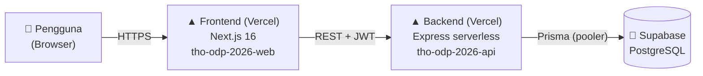
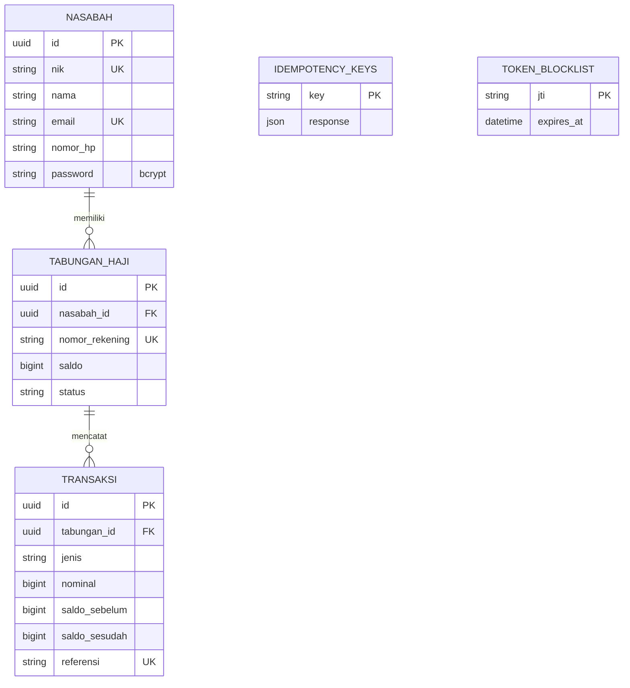
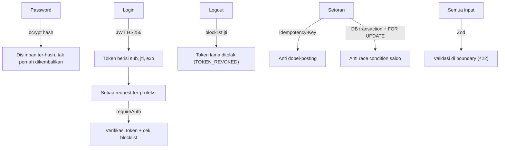
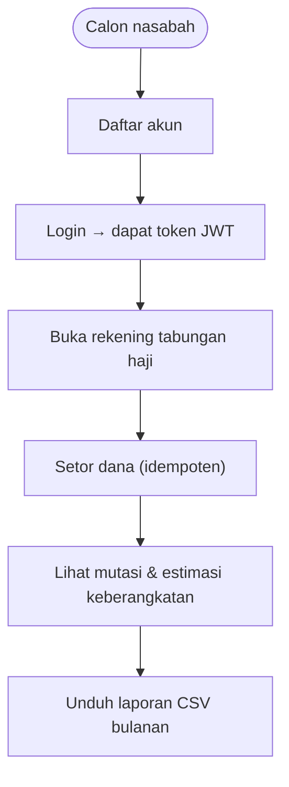
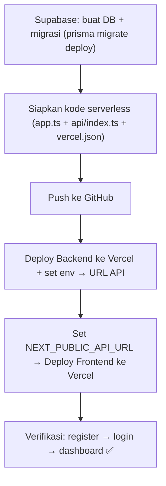

# LAPORAN PROYEK
# Sistem Tabungan Haji — BSI (THO ODP 2026)

| | |
|---|---|
| **Nama Sistem** | Sistem Tabungan Haji (Digital Sanctuary) |
| **Versi** | 1.0 |
| **Tanggal** | 29 Mei 2026 |
| **Status** | ✅ Live di Production (Vercel + Supabase) |
| **Repositori** | `saint-izrail/THO_ODP_2026` (API) · `saint-izrail/THO_ODP_2026_web` (Web) |
| **URL Web** | https://tho-odp-2026-web.vercel.app |
| **URL API** | https://tho-odp-2026-api.vercel.app |

---

## 1. Ringkasan Eksekutif

Sistem Tabungan Haji adalah aplikasi web untuk mengelola tabungan calon jemaah haji: pendaftaran nasabah, pembukaan rekening, setoran dana, pencatatan mutasi transaksi, estimasi tahun keberangkatan, dan laporan bulanan. Sistem dibangun dengan arsitektur **tiga lapis** terpisah — frontend, backend API, dan database — yang seluruhnya sudah berjalan di lingkungan production.

Aplikasi mengusung identitas visual **Bank Syariah Indonesia (BSI)**: hijau tosca + aksen emas, dengan gaya antarmuka *glassmorphism* yang modern dan bersih.

---

## 2. Tujuan & Ruang Lingkup

**Tujuan:** menyediakan pencatatan tabungan haji yang akurat, aman, dan auditable, sekaligus memberi transparansi kepada nasabah lewat riwayat mutasi dan estimasi keberangkatan.

**Dalam lingkup:** manajemen nasabah, autentikasi (JWT), pembukaan rekening, setoran (idempoten), mutasi, estimasi keberangkatan, laporan CSV, dan antarmuka web.

**Di luar lingkup:** penarikan dana, integrasi payment gateway, peran bertingkat (admin/petugas), notifikasi, integrasi SISKOHAT.

---

## 3. Teknologi yang Digunakan

| Lapisan | Teknologi |
|---|---|
| **Frontend** | Next.js 16 (App Router), React 19, TypeScript, Tailwind CSS v4 |
| **Backend** | Node.js, Express 5, TypeScript |
| **ORM / DB** | Prisma 6, PostgreSQL (Supabase) |
| **Validasi** | Zod |
| **Keamanan** | JWT (jsonwebtoken), bcrypt, helmet, cors |
| **Hosting** | Vercel (frontend & backend serverless) |
| **Database Cloud** | Supabase (region Tokyo) |
| **Version Control** | Git + GitHub |

---

## 4. Arsitektur Sistem



Pola berlapis: setiap request mengalir **Route → Middleware Auth → Controller (validasi Zod) → Service (logika + DB) → Prisma → PostgreSQL**. Semua respons memakai envelope konsisten `{ data, error, meta }`.

---

## 5. Model Data



Nilai uang disimpan sebagai **BigInt** (rupiah penuh) demi presisi. Setiap transaksi mencatat saldo sebelum & sesudah untuk audit.

---

## 6. Modul Backend & Daftar Endpoint

| Method | Endpoint | Auth | Fungsi |
|---|---|---|---|
| GET | `/health` | — | Cek kesehatan API |
| POST | `/api/v1/auth/login` | — | Login, terbitkan JWT |
| POST | `/api/v1/auth/logout` | ✔ | Revoke token (blocklist) |
| POST | `/api/v1/nasabah` | — | Registrasi nasabah |
| GET | `/api/v1/nasabah` | ✔ | Daftar nasabah (pagination + cari) |
| GET | `/api/v1/nasabah/:id` | ✔ | Detail nasabah |
| PATCH | `/api/v1/nasabah/:id` | ✔ | Ubah data nasabah |
| DELETE | `/api/v1/nasabah/:id` | ✔ | Hapus nasabah |
| POST | `/api/v1/tabungan-haji` | ✔ | Buka rekening |
| GET | `/api/v1/tabungan-haji/saya` | ✔ | Tabungan milik nasabah login |
| GET | `/api/v1/tabungan-haji/:id` | ✔ | Detail tabungan |
| POST | `/api/v1/tabungan-haji/:id/setor` | ✔ | Setor (Idempotency-Key) |
| GET | `/api/v1/tabungan-haji/:id/mutasi` | ✔ | Riwayat mutasi |
| GET | `/api/v1/tabungan-haji/:id/estimasi` | ✔ | Estimasi keberangkatan |
| GET | `/api/v1/reports/transaksi-bulanan` | ✔ | Laporan CSV bulanan |

---

## 7. Halaman Frontend

| Halaman | Rute | Fitur |
|---|---|---|
| **Login** | `/login` | Form login, validasi, simpan token |
| **Registrasi** | `/register` | 6 field + validasi + auto-login |
| **Dashboard** | `/dashboard` | Saldo, estimasi, progress "Langkah Menuju Baitullah", layanan cepat |
| **Tabungan** | `/dashboard/tabungan` | Detail rekening, buka rekening, setor |
| **Mutasi** | `/dashboard/mutasi` | Tabel transaksi, pagination, filter jenis |
| **Profil** | `/dashboard/profil` | Lihat & edit data diri |
| **Laporan** | `/dashboard/laporan` | Unduh CSV transaksi bulanan |

Semua halaman memakai palet BSI (teal `#00a39d` / deep teal `#004f4c` + emas `#f8ad3c`), gaya glassmorphism, font Plus Jakarta Sans, dan sudah memenuhi standar aksesibilitas (label, ARIA, kontras WCAG).

---

## 8. Fitur Keamanan



- **bcrypt** untuk hash password.
- **JWT** dengan revocation (blocklist saat logout).
- **Idempotency-Key** mencegah setoran dobel.
- **Transaksi DB + row lock** menjaga konsistensi saldo.
- **Validasi Zod** di setiap input.

---

## 9. Alur Bisnis Utama (End-to-End)



---

## 10. Deployment



| Komponen | Production |
|---|---|
| Frontend | https://tho-odp-2026-web.vercel.app |
| Backend | https://tho-odp-2026-api.vercel.app |
| Database | Supabase PostgreSQL (Tokyo) |

> Catatan teknis: koneksi migrasi memakai **Session Pooler (IPv4)** Supabase karena koneksi Direct (IPv6) tidak terjangkau dari jaringan IPv4. Backend dijalankan sebagai **serverless function** di Vercel dengan `prisma generate` otomatis saat build. Detail lengkap ada di `docs/DEPLOYMENT.md`.

---

## 11. Struktur Proyek

```
THO_ODP_2026 (Backend)
├── api/index.ts            # entry serverless Vercel
├── prisma/                 # schema + migrations
├── src/
│   ├── app.ts              # Express app (export)
│   ├── index.ts            # server lokal
│   ├── lib/prisma.ts       # Prisma client
│   └── modules/            # auth, nasabah, tabungan-haji, reports
├── vercel.json
└── docs/                   # BRD, flowchart, deployment, laporan

THO_ODP_2026_web (Frontend)
├── src/app/                # login, register, dashboard/*
├── src/components/         # form, shell, ikon, status pill
├── src/lib/                # api, auth, format
└── docs/
```

---

## 12. Status & Kesimpulan

Seluruh fitur dalam lingkup telah **selesai dibangun, teruji, dan berjalan di production**. Proses pengembangan menerapkan:

- **Verifikasi berlapis**: type-check, lint, build, uji E2E (API & browser), dan screenshot visual.
- **Review adversarial** otomatis (multi-agen) yang menemukan & memperbaiki puluhan isu kontras WCAG, aksesibilitas, dan kontrak API sebelum rilis.
- **Dokumentasi lengkap**: BRD, flowchart sistem, panduan deployment, dan laporan ini.

Sistem siap dipakai dan mudah dikembangkan lebih lanjut (mis. penarikan dana, peran bertingkat, notifikasi).

---

*Laporan ini bagian dari Tugas Akhir ODP 2026 — Sistem Tabungan Haji BSI.*
